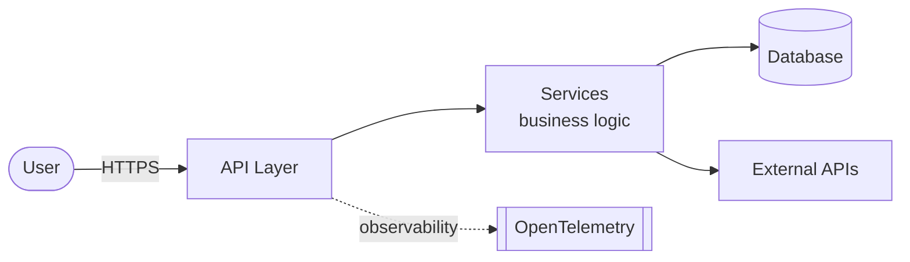
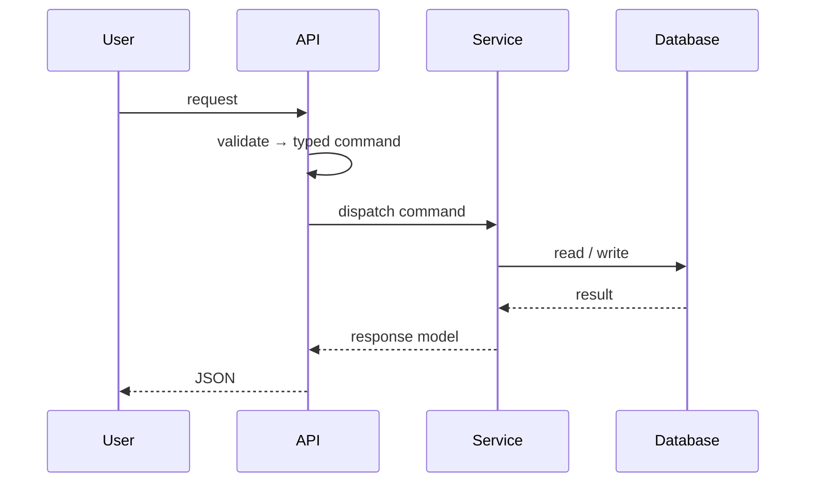

# Architecture

_The narrative, diagram-bearing view for people. The terse agent version is `.ai/architecture.md`;
keep them in sync. Diagrams use [Mermaid](https://mermaid.js.org), which renders on GitHub._

## What this system is
[One or two paragraphs: the product, its users, the core value it delivers.]

## System overview

## Request lifecycle

## Components
### [API layer] — `src/api/`
[What it owns. Key decision + link to the ADR. Cross-ref `.ai/architecture.md#components`.]

### [Services] — `src/services/`
[Where business rules live and why nothing else may hold them.]

### [Data layer] — `src/db/`
[The single path to persistence; the invariant it protects.]

## Cross-cutting concerns
- **Auth:** [approach] — see `adr/[NNNN]`.
- **Observability:** [OpenTelemetry GenAI/HTTP spans → backend].
- **Error handling:** [standard error shape, where it's defined].

## Where to go next
- Decisions behind this design → [adr/](adr/)
- How a specific feature works → [features/](features/)
