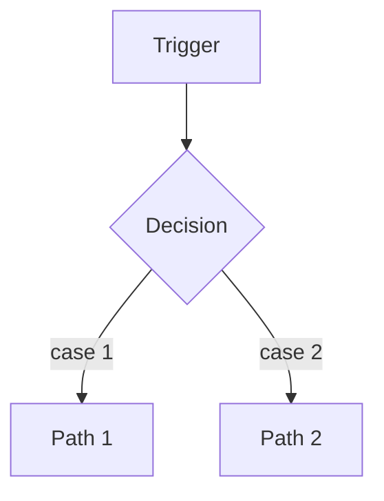

# Feature: [Name]

_One doc per non-trivial feature. Written for a human who needs to understand or change it.
Link it from the code and from `.human/architecture.md`._

## What it does
[Plain-English description of the user-facing behavior.]

## How it works
[The mechanism, at a level a new team member can follow. A small Mermaid diagram if it helps.]

## Where the code is
- Entry point: `src/...`
- Core logic: `src/...`
- Tests: `tests/...`

## Key decisions
- [Decision] — see `.human/adr/NNNN`.

## Edge cases & known limitations
- [Edge case] → [how it's handled].
- [Limitation] → [why, and any planned work in `.ai/project-state.md`].

## How to change it safely
- [What to watch for; which invariants (`.ai/architecture.md`) apply; which tests must stay green.]
