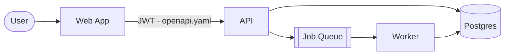

# Architecture — human view

> The narrative, diagram-first companion to [`../.ai/architecture.md`](../.ai/architecture.md).
> When the two disagree, the `.ai/` version is authoritative — fix this one.

## The big picture

<Two or three paragraphs: what the system does, who uses it, and the shape of how it's built.
Write for a developer who has never seen the codebase.>

## How a request flows
1. <e.g. the browser calls `/api/...` with a JWT>
2. <the API validates, does the work, enqueues async jobs>
3. <the worker drains the queue and writes back>

## Why it's shaped this way
<The 2–3 decisions that most explain the structure, each linking to its ADR
(`adr/`) and its decision trace (`../.ai/decisions/`).>

## Where things live
| I want to… | Look in |
|---|---|
| _(example — delete)_ change an API route | `src/api/**` |
| _(example — delete)_ add a background job | `src/worker/**` |
