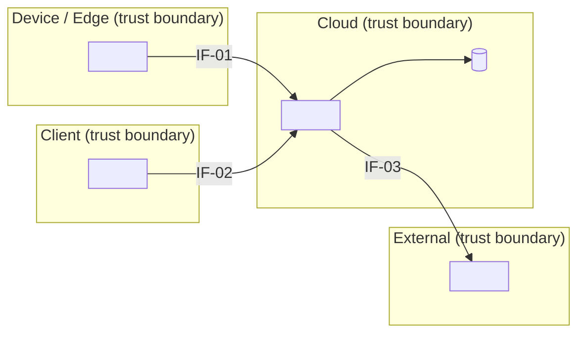
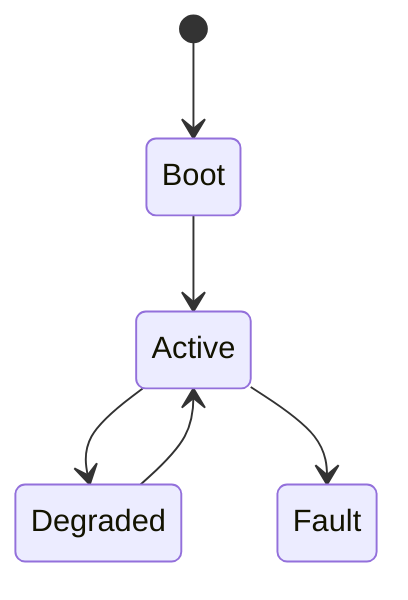
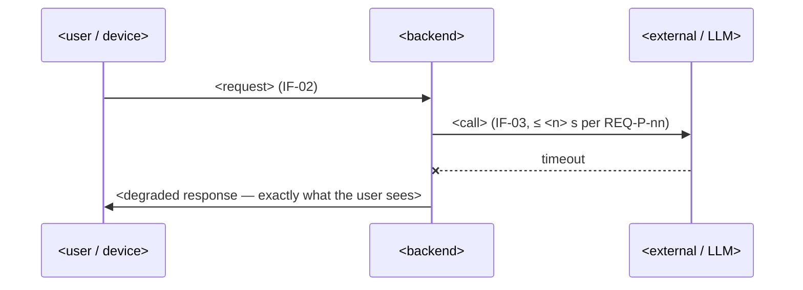

# Architecture & Interfaces — <Product Name>

> **Phase 2 · feeds G2 Design Freeze.** Time budget: **one day.** One page, one diagram, THE INTERFACE TABLE, one threat walk. Exists to prevent the classic solo-hybrid death: both sides of a seam built before the seam was pinned — connectors that don't mate, schemas nobody wrote down, timeouts nobody set. Litmus for what belongs here: **"does it change which blocks exist or how they connect? Then decide now; otherwise defer."** Delete sections that don't apply — one line in the tracker's tailoring log.

**Owner:** <…> · **Date:** <…> · **Status:** Draft / FROZEN (G2, <date>) / Superseded (via change note DEC-<nn>)

## 1. Architecture drivers (3–5)

> The constraints that actually shape the boxes — sourced from REQs, never taste.

| # | Driver | Source |
|---|---|---|
| 1 | <e.g. must run 24 h offline> | REQ-O-<nn> |
| 2 | <e.g. BOM ≤ $<n> at qty 100> | REQ-C-<nn> |
| 3 | <e.g. user data never leaves the device> | REQ-SEC-<nn> |

## 2. Principles (3–5 — one line + why)

| Principle | Why |
|---|---|
| <e.g. boring tech first> | <solo team debugs everything alone> |
| <e.g. local-first, degrade gracefully> | <driver 1 — connectivity is not guaranteed> |
| <e.g. buy before build> | <build only what differentiates> |

## 3. Context & deployment diagram (ONE, ≤12 boxes)

> Zones: Device/Edge · Cloud · Client · External. Zone borders ARE the trust boundaries. Label every boundary-crossing arrow `IF-nn` — each label is a §4 row. Arrows inside a zone stay unlabeled. **>12 boxes → split the product, not the file.**

Allocation sanity — answer both: any REQ with no home block? Any block that serves no REQ? Fix or `TODO` — never silence.

## 4. THE INTERFACE TABLE — pinned at G2

> One row per seam where two independently built pieces meet: device↔cloud, app↔API, code↔third-party, model↔app. Never "JSON over HTTP" — name the schema and link it. Latency budgets come from a REQ-P row or are `TODO: <owed, by whom, by when>` — never invented. Failure behaviour is mandatory per row — timeout/retry · offline-buffer · degrade: pick one and specify; an empty cell fails G2. Run the interface-seam interrogation ([`../AI_PROMPTS.md`](../AI_PROMPTS.md) #4) before freezing. **PINNED at G2 — post-freeze changes only via a change note in [`15_decision_log.md`](15_decision_log.md).**
> Behaviour a seam must *guarantee* (buffering, retry limits) is specced as a `REQ-INT` row in `06_spec.md` §5 citing its IF-nn — the IF row records the mechanism; the REQ-INT row makes it verifiable.

| IF-nn | Endpoints (A↔B) | Transport + protocol | Message format (NAMED schema + link) | Auth | Cadence | Latency / timeout budget | Failure behaviour | Versioning | Trust boundary? |
|---|---|---|---|---|---|---|---|---|---|
| IF-01 | <device> ↔ <API> | <MQTT over TLS 1.3> | <topic contract: `specs/telemetry.schema.json`> | <per-device cert> | <30 s heartbeat> | <≤ 500 ms from REQ-P-nn \| TODO> | <offline buffer 24 h, FIFO drain on reconnect> | <semver in topic> | Y |
| IF-02 | <client> ↔ <API> | <HTTPS + REST> | <OpenAPI 3.1: `specs/api.yaml`> | <OAuth / session> | <event-driven> | <p95 ≤ <n> ms from REQ-P-nn> | <retry ×3 w/ backoff → error UX> | <URL version> | Y |
| IF-03 *(example — delete)* | API ↔ LLM provider | HTTPS | provider messages API, pinned model ID | API key, server-side only | per request | timeout <n> s from REQ-P-nn | timeout → fallback model / degrade honestly | pinned model ID | Y |

## 5. State machine *(conditional — devices, agents, sessions, connections that drop; else delete)*

> From the modes table in [`06_spec.md`](06_spec.md) §2. **Never invent a transition** — every state needs an exit; unknowns are `TODO`, not arrows.

## 6. Sequence sketch — the nastiest flow

> One diagram of the flow most likely to break (mid-operation failure, retry storm, device↔cloud handshake). Latency budgets from REQ-P rows, or `TODO`.

## 7. Stack + NOT using

| Tier | Choice | Why (REQ / principle) |
|---|---|---|
| <SBC / MCU / sensors> **[HW]** | <…> | <REQ-C-nn / principle> |
| <backend / runtime> | <…> | <…> |
| <datastore> | <…> | <…> |
| <model + inference: local or API> **[AI]** | <…> | <REQ-P-nn / cost driver> |

**NOT using** (≥3 named rejections, each tied to a REQ or principle — "we considered others" fails the gate):
- <rejected tech> — <blocks REQ-<nn> / violates principle "<…>">
- <rejected tech> — <…>
- <rejected tech> — <…>

Expensive-to-reverse choices above → an ADR in [`15_decision_log.md`](15_decision_log.md).

## 8. Trust & Threats *(Security & Data thread home — re-walk whenever §4 changes)*

**STRIDE-lite walk — one pass per boundary in §3.** Third-party APIs, identity providers, LLM endpoints, and MQTT brokers are boundaries too. Start by element type: external entity → Spoofing; data flow → Tampering / Disclosure / DoS; data store → Tampering / Disclosure; process → all six. Mitigate in order: **eliminate → prevent → detect → respond.**

| Boundary (IF-nn) | Worst plausible threat | Mitigation (order above) | Residual — accepted by name |
|---|---|---|---|
| <IF-01> | <spoofed device injects commands> | <prevent: per-device cert + signed payloads> | <RSK-nn \| accepted: <who, date>> |

**Hygiene floor — non-negotiable, even for prototypes:**
- [ ] Secrets out of code (env / secret manager; repo scanned)
- [ ] Least-privilege keys and roles
- [ ] HTTPS + auth on every endpoint — no "internal only" exceptions
- [ ] Dependency scanning on in CI
- [ ] Backups exist AND a restore was TESTED
- [ ] **[HW]** Device ports default-deny

**[AI]** Prompt injection is a trust boundary — retrieved/user/tool content is data, never instructions · provider keys are crown jewels: server-side only, rotated · model-file provenance for local weights (source + hash).
**[HW]** OTA updates signed · no default credentials ship · physical ports (UART/JTAG/SD) are attack surface.

**Data handling:** personal data held: <…> · where: <…> · lawful basis: <…> · deletion path: <…>.

## 9. Decisions

Hard-to-reverse choices from §4/§7 → ADRs: [`15_decision_log.md`](15_decision_log.md) DEC-<nn>, DEC-<nn>. New risks surfaced here → [`16_risk_register.md`](16_risk_register.md).

---

### G2 self-check — architecture slice (delete once FROZEN)

- [ ] Every crossing arrow in §3 has a filled §4 row — no vague rows, no empty failure-behaviour cells
- [ ] Every latency budget cites a REQ-P or carries a `TODO` — none invented; both allocation-sanity questions answered
- [ ] NOT-using list: ≥3 named rejections tied to a REQ or principle
- [ ] Every boundary walked in §8; hygiene floor 100%
- [ ] Status set to FROZEN (G2, date) — changes now go through a change note
