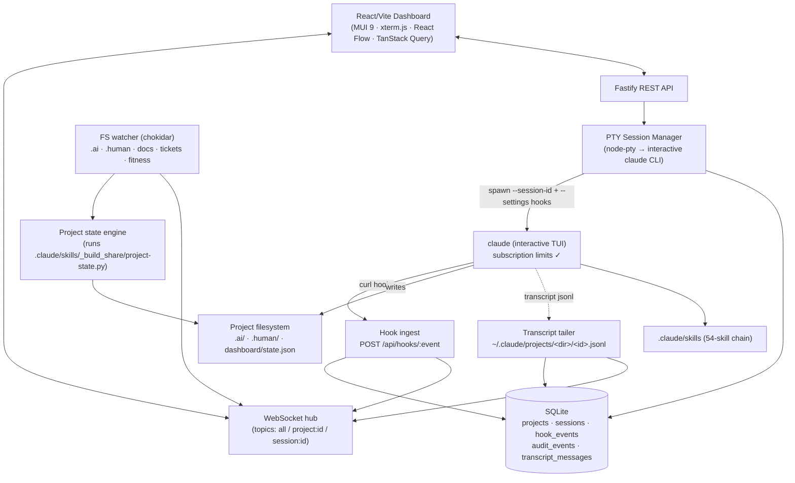

# Architecture

## System overview

## The load-bearing decision: interactive PTY, not headless `-p`

The original "obvious" design — `claude -p --output-format stream-json` parsed
by the backend — was rejected because Anthropic's June 15, 2026 billing change
moves headless/Agent SDK usage on subscription plans to a **separate monthly
Agent SDK credit pool** billed at API rates. Interactive sessions are
explicitly unaffected. The platform mandate is "no separate credit pools", so:

- The backend spawns the **interactive** `claude` TUI inside a pseudo-terminal.
- The dashboard embeds the real TUI via xterm.js — permission prompts, menus,
  and trust dialogs work exactly as in a terminal (no permission-bypass flags
  are ever passed).
- Structured telemetry comes from **hooks** and **transcript tailing**, which
  are free and billing-neutral.

See [ADR-0001](adr/0001-pty-over-headless.md).

## Observability spine

| Channel | Carries | Latency |
|---------|---------|---------|
| Hooks (`SessionStart/End`, `UserPromptSubmit`, `Pre/PostToolUse`, `Stop`, `SubagentStop`, `Notification`) | Lifecycle + every tool call | ~instant (curl from hook) |
| Transcript tail | Full message content (text, tool_use, tool_result) | < 2 s (fs.watch + poll fallback) |
| FS watcher | Artifact changes in `.ai/`, `.human/`, … | debounced 800 ms |
| PTY stream | Raw terminal frames (rendered, also ring-buffered 400 KB for reconnect replay) | instant |

Everything lands in two places: the **SQLite audit trail** (queryable via
`GET /api/events`, summarized via `GET /api/metrics`) and the **WebSocket**
(live UI). Server logs are structured JSON (pino) written to stdout + `data/server.log`.

Hooks are injected per-session via a generated `--settings` file
(`data/claude-hook-settings.json`) so the user's own settings files are never
mutated, and sessions started outside the dashboard are unaffected. Hook
commands use `curl --max-time 3 … || true` so a dead backend can never block
Claude.

## State model: reuse the chain's own generator

`dashboard/state.json` is produced by the chain's `_build_share/project-state.py`
(the same spine `/status`, `/next`, and `/coherence-check` read). The backend
shells out to it (debounced on artifact changes) instead of reimplementing the
parsing — the dashboard can never drift from what the skills themselves see.
The shared package adds a typed stage graph (`packages/shared/src/stageModel.ts`)
that maps state onto the pipeline visualization and per-feature stage statuses.

Verdict routing stays with the user: the dashboard recommends and launches
skills, but never auto-advances the chain (matching the skills' own
"no skill invokes another" rule).

## Reliability & recovery

- **Sessions** are spawned with a backend-generated UUID passed as
  `--session-id`, so the transcript path is deterministic and resume is exact:
  `claude --resume <id>` reattaches the same conversation.
- On boot, sessions still marked running are flagged **interrupted** and
  surfaced on the dashboard with one-click resume.
- On SIGINT/SIGTERM the server kills its PTYs (no zombie `claude` processes).
- SQLite WAL mode; all observability data survives restarts. Transcripts can
  be backfilled from disk if live tailing missed them.

## Security posture

- Backend binds `127.0.0.1` only; single-user local tool.
- Docs API resolves paths inside the project root (traversal-blocked) and
  serves only renderable text formats.
- No `--dangerously-skip-permissions`; permission decisions stay with the user
  in the embedded TUI.

## Known limitations / future work

- Sessions started outside the dashboard are not observed (by design; an
  opt-in global hook install could add them).
- The chat input types into the PTY — if Claude is mid-tool-approval, input
  goes to that prompt (the Terminal tab is the source of truth).
- OpenTelemetry export (`CLAUDE_CODE_ENABLE_TELEMETRY=1` + OTLP collector) is
  a documented extension point, not wired by default.
- Kanban board for feature slices and a richer timeline view are natural next
  features; the data (slices, statuses, audit trail) is already in the API.

## Assumptions log

1. `.claude/skills` in this repo was an empty directory skeleton; the full
   skill content was synced from the sibling `SDLC-skills-UI` repo (54 skills).
2. Python 3 is available (`python3`) — used only for the chain's own stdlib
   state generator.
3. Single user, single machine; PostgreSQL "cloud mode" deferred — SQLite is
   the local source of truth.
4. The June 15, 2026 billing change is as documented by Anthropic
   (support article 15036540); if it shifts, a headless runner could be added
   behind the same SessionManager interface.
