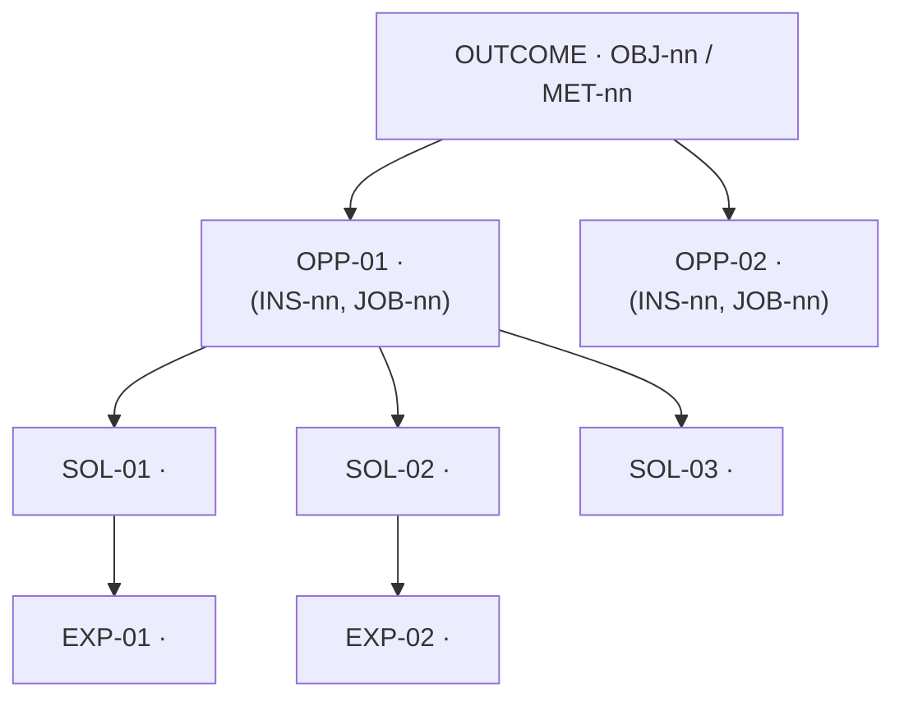

<!--
WHAT THIS IS — A living map (Teresa Torres) from ONE desired outcome down through
opportunities (customer needs/pains/desires) to candidate solutions to experiments.
It makes the traceability spine (Conventions §4) visible: OBJ/KR → OPP → SOL → EXP/ASM → MET.

HOW TO USE — Fill top-down. Replace every <ANGLE_BRACKET> or resolve every "TODO:".
Owning skill: pm-phase-04-opportunity (../skills/pm-phase-04-opportunity/SKILL.md).
Sibling templates: Opportunity_Assessment.md · Business_Case.md.
Conforms to ../05_Conventions.md (§3 IDs, §4 spine, §6 frontmatter, §7 outcomes-over-outputs).

STATUS — This artifact is *Living* per Conventions §6. Keep it at Draft only until first
populated, then flip Status to `Living`. NEVER freeze it — revisit every discovery cycle.
Bump the version minor on each tracked edit; log changes at the bottom.

DISCIPLINE — One outcome per tree. Every OPP traces to evidence (INS-*/JOB-*) — no opportunity
without evidence. Compare 2-3 solutions per opportunity (one-solution-per-OPP is an anti-pattern).
Never invent evidence, a metric, or a number — mark "TODO: <owed — by whom — by when>".
-->

# Opportunity Solution Tree

> One desired outcome → the opportunity space → candidate bets → experiments.
> *Not a feature list. Not a backlog. A map of where customer value and the outcome meet.*

---

## 1. The desired outcome (root — the metric tree)

<!-- The single outcome this tree serves. It is an OBJ/KR from North_Star_and_OKRs.md,
expressed as a moved metric — never a feature or a date. If no OBJ/KR fits, that is a
strategy-fit signal (likely No-Go), not a reason to invent one. -->

- **Outcome:** `OBJ-<nn>` / `KR-<nn>` — <outcome in one outcome-shaped sentence>
- **North Star / product metric it rolls up to:** `MET-<nn>` — <metric name + current → target>
- **Why now (Rumelt diagnosis fit):** <the obstacle this outcome removes> — *traces to `../01_Strategy/Product_Strategy.md`*

```text
Metric tree (decompose the outcome into the input metrics opportunities can move):

   OUTCOME  OBJ-<nn> / MET-<nn>  <headline metric>
   ├── input metric  MET-<nn>  <driver 1>      ◀── moved by OPP-<nn>
   ├── input metric  MET-<nn>  <driver 2>      ◀── moved by OPP-<nn>
   └── input metric  MET-<nn>  <driver 3>      ◀── moved by OPP-<nn>
```
<!-- TODO: confirm each input metric is instrumented or owed to pm-phase-12-analytics (MET-TBD). -->

---

## 2. The tree (outcome → OPP → SOL → EXP)

<!-- Edit the skeleton below. Keep labels = IDs + short human phrase. An opportunity is a
NEED/PAIN/DESIRE in the customer's words, NOT a solution. Litmus test: if only one
implementation could address it, it is a solution masquerading as an opportunity — reframe
one level up. Add/prune branches freely; this map is never "done". -->


<!-- If you can't render Mermaid, use the indented text form instead:
OUTCOME OBJ-nn
  OPP-01 <need>  (INS-nn, JOB-nn)
    SOL-01 <bet A>  → EXP-01 <test>
    SOL-02 <bet B>  → EXP-02 <test>
  OPP-02 <need>  (INS-nn, JOB-nn)
    ...
-->

---

## 3. Opportunity nodes (`OPP-*`)

<!-- Every row = a real, evidenced customer need. "Evidence" links a customer quote/behaviour,
not a survey stat. Mark gut-driven claims "TODO: validate via interview". IDs are stable for
the life of the product (Conventions §3) — never renumber; retire with "(deprecated)". -->

| ID | Opportunity (customer's words) | Serves outcome | Evidence (INS/JOB/PER) | Sized? | Status |
|---|---|---|---|---|---|
| `OPP-01` | <need / pain / desire> | `OBJ-nn`/`KR-nn` | `INS-nn`, `JOB-nn`, `PER-nn` | see Opportunity_Assessment.md | <Exploring / Assessing / Selected / Parked> |
| `OPP-02` | <…> | `OBJ-nn` | `INS-nn` | TODO: size | <…> |
| `OPP-nn` | TODO: | | TODO: evidence | | |

> Sizing, the four big risks, and the Go/No-Go for the **selected** opportunity live in
> **Opportunity_Assessment.md** and **Business_Case.md** — don't duplicate them here.

---

## 4. Solution nodes (`SOL-*`) — compare 2-3 per opportunity

<!-- Seed only. SOL-* are owned and de-risked by pm-phase-07-solution-design. One bet per
opportunity is an anti-pattern — list real alternatives, including the status-quo / "do nothing". -->

| ID | Under OPP | Candidate solution (one line) | Why it might work | Owner phase |
|---|---|---|---|---|
| `SOL-01` | `OPP-01` | <bet A> | <hypothesised mechanism> | pm-phase-07-solution-design |
| `SOL-02` | `OPP-01` | <bet B> | <…> | pm-phase-07-solution-design |
| `SOL-03` | `OPP-01` | <bet C / do-nothing baseline> | <…> | — |

---

## 5. Experiment nodes (`EXP-*`) — test the riskiest assumption first

<!-- One row per planned test. Pull the load-bearing ASM-* from Opportunity_Assessment.md's
four-big-risks table; test the HIGHEST-importance, LOWEST-evidence assumption first — not the
easiest. EXP-* are owned by pm-phase-13-experimentation. Write the hypothesis as a falsifiable
Given/When/Then so "pass" and "fail" are unambiguous BEFORE you run it. -->

| ID | Tests SOL | Load-bearing assumption | Hypothesis (Given / When / Then) | Pass threshold | Status |
|---|---|---|---|---|---|
| `EXP-01` | `SOL-01` | `ASM-nn` | **Given** <context> **when** <we do X> **then** <observable result> | <metric ≥ X> | <Planned / Running / Done> |
| `EXP-02` | `SOL-02` | `ASM-nn` | **Given** … **when** … **then** … | TODO: | <…> |

---

## 6. What's in flight — Now / Next / Later

<!-- The OST shows the whole space; this shows where the team's attention IS. Keep it honest:
"Now" should be one, maybe two branches. Everything else is Next/Later or Parked. -->

| Horizon | Branch (OPP → SOL → EXP) | Why this, this cycle |
|---|---|---|
| **Now** | `OPP-nn` → `SOL-nn` → `EXP-nn` | <riskiest assumption / clearest evidence> |
| **Next** | `OPP-nn` | <what unlocks it> |
| **Later** | `OPP-nn` | <directional only> |
| **Parked** | `OPP-nn` | <why parked + what would reopen it> |

---

## 7. Open questions & owed evidence

<!-- The honest list of what we don't know yet. Each becomes an interview, a research task,
or an experiment. Never paper over a gap with a guessed number. -->

- TODO: <unknown — owner — by when>
- TODO: <unknown — owner — by when>

---

## Change log (Living)

| Date | v | Change | By |
|---|---|---|---|
| <YYYY-MM-DD> | v0.1 | Initial tree from Phase 04 assessment | <name> |

---

### Links
- **Owning skill:** pm-phase-04-opportunity — `../skills/pm-phase-04-opportunity/SKILL.md`
- **Sibling deliverables:** [Opportunity_Assessment.md](Opportunity_Assessment.md) · [Business_Case.md](Business_Case.md)
- **Upstream evidence:** `../03_Discovery/Research_Insights.md` (`INS-*`) · `JTBD.md` (`JOB-*`) · `Personas.md` (`PER-*`)
- **Outcomes:** `../01_Strategy/North_Star_and_OKRs.md` (`OBJ-*`/`KR-*`) · `Product_Strategy.md`
- **Downstream:** `../05_Roadmap/Roadmap.md` · `../06_Prioritization/Prioritization_Matrix.md` · `../07_Solution/Assumption_Map.md`
- **Convention contract:** `../05_Conventions.md` · **Framework card:** `../frameworks/` (Opportunity Solution Tree — Torres)
- **Continuous-discovery thread:** `../cross-cutting/Continuous_Discovery.md`
