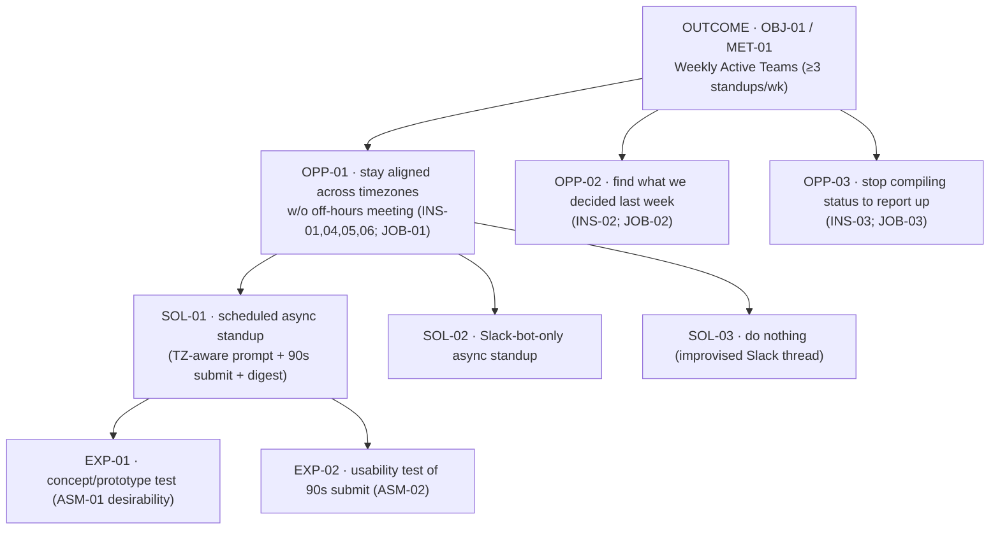

# Opportunity Solution Tree — Cadence

> One desired outcome → the opportunity space → candidate bets → experiments.
> *A map of where customer value and the outcome meet — not a feature list.*

---

## 1. The desired outcome (root — the metric tree)

- **Outcome:** `OBJ-01` / `KR-01` — make async standups the default way distributed teams stay aligned (grow Weekly Active Teams 0 → 120 by 2026-09-30).
- **North Star it rolls up to:** `MET-01` — Weekly Active Teams (≥3 standups/wk); 0 → 120.
- **Why now (Rumelt diagnosis fit):** removes the false choice between an off-hours live standup and missed alignment — *traces to [../01_Strategy/Product_Strategy.md](../01_Strategy/Product_Strategy.md) §1.*

```text
Metric tree:

   OUTCOME  OBJ-01 / MET-01  Weekly Active Teams (≥3 standups/wk)
   ├── input metric  MET-03  activation (1st standup <48h)   ◀── moved by OPP-01
   ├── input metric  MET-04  completion rate                 ◀── moved by OPP-01
   ├── input metric  MET-02  invite-loop (breadth)           ◀── moved by OPP-01
   └── input metric  MET-05  frequency (standups/wk)         ◀── moved by OPP-01, OPP-02
```

---

## 2. The tree (outcome → OPP → SOL → EXP)



---

## 3. Opportunity nodes (`OPP-*`)

| ID | Opportunity (customer's words) | Serves outcome | Evidence | Sized? | Status |
|---|---|---|---|---|---|
| `OPP-01` | "Stay aligned daily across timezones without forcing anyone off-hours or into a meeting" | `OBJ-01`/`KR-01` | INS-01, INS-04, INS-05, INS-06; JOB-01; PER-01, PER-02 | see Opportunity_Assessment.md | **Selected** |
| `OPP-02` | "Find what we decided last week without re-asking the team" | `OBJ-01`/`KR-01` | INS-02; JOB-02 | TODO: size (P04) | Assessing (→ Next on roadmap) |
| `OPP-03` | "Stop manually compiling team status to report up" | `OBJ-01` | INS-03; JOB-03 | TODO: size | Exploring |
| `OPP-04` | "Get my focus/maker time back from the daily live meeting" | `OBJ-01` | INS-04 | — | Parked (subsumed by OPP-01 — same switch) |

> Sizing, four-big-risks, and the Go/No-Go for **OPP-01** live in **Opportunity_Assessment.md** / **Business_Case.md** (illustrative TAM/SAM there).

---

## 4. Solution nodes (`SOL-*`) — compare 2–3 per opportunity

| ID | Under OPP | Candidate solution | Why it might work | Owner phase |
|---|---|---|---|---|
| `SOL-01` | `OPP-01` | Scheduled async standup: timezone-aware prompt → structured 90s submit (Done/Doing/Blockers) → auto-compiled team digest | Lowest friction; produces a complete, readable, searchable record; doubles as the activation + growth event | pm-phase-07-solution-design |
| `SOL-02` | `OPP-01` | Slack-bot-only async standup (lives entirely in Slack) | Zero new surface to learn | pm-phase-07-solution-design |
| `SOL-03` | `OPP-01` | Do nothing — keep the improvised Slack thread (status-quo baseline) | Free; teams already do it | — |

---

## 5. Experiment nodes (`EXP-*`) — test the riskiest assumption first

| ID | Tests SOL | Load-bearing assumption | Hypothesis (Given/When/Then) | Pass threshold | Status |
|---|---|---|---|---|---|
| `EXP-01` | `SOL-01` | `ASM-01` (teams will *replace* the live daily standup) | **Given** a distributed team shown the async-standup prototype, **when** they run it for 1 week, **then** ≥60% drop or shrink their live daily standup | ≥60% reduce live daily sync; n=8 teams | Done (pass) |
| `EXP-02` | `SOL-01` | `ASM-02` (submit in <90s, no training) | **Given** a first-time member, **when** they submit a standup, **then** median time < 90s with ≥80% task success | median <90s, ≥80% success; n=5 | Done (pass) |
| `EXP-03` | `SOL-01` | completion driver | **Given** active teams, **when** reminder fires at member-local time vs fixed UTC, **then** completion rate rises | MET-04 +≥5pp | Done — see [../13_Experiments/Experiment_Readout.md](../13_Experiments/Experiment_Readout.md) |

---

## 6. What's in flight — Now / Next / Later

| Horizon | Branch (OPP → SOL → EXP) | Why this, this cycle |
|---|---|---|
| **Now** | `OPP-01` → `SOL-01` → `EXP-01/02` | Highest opportunity score; the core switch + the activation/growth event |
| **Next** | `OPP-02` (searchable notes) | Owns the record; lifts retention once the habit lands |
| **Later** | `OPP-03` (status roll-up) | Rides on the digest; directional |
| **Parked** | `OPP-04` | Subsumed by OPP-01 (same switch) — reopen only if focus-time signal diverges |

---

## 7. Open questions & owed evidence
- TODO: size OPP-02 search demand quantitatively — owner PM — by 2026-07-15.
- TODO: confirm meeting-reduction (RSK-01) holds at scale post-GA — owner PM — 2026-Q3.

---

## Change log (Living)
| Date | v | Change | By |
|---|---|---|---|
| 2026-03-05 | v0.1 | Initial tree from Phase 04 assessment | PM |
| 2026-03-12 | v1.1 | OPP-01 Selected at G3 (DEC-03); OPP-04 parked into OPP-01 | PM |

---

### Links
- **Owning skill:** pm-phase-04-opportunity · **Siblings:** Opportunity_Assessment.md · Business_Case.md
- **Upstream:** [../03_Discovery/Research_Insights.md](../03_Discovery/Research_Insights.md) · [../03_Discovery/JTBD.md](../03_Discovery/JTBD.md)
- **Outcomes:** [../01_Strategy/North_Star_and_OKRs.md](../01_Strategy/North_Star_and_OKRs.md)
- **Downstream:** [../05_Roadmap/Roadmap.md](../05_Roadmap/Roadmap.md) · [../06_Prioritization/Prioritization_Matrix.md](../06_Prioritization/Prioritization_Matrix.md) · [../07_Solution/Solution_Validation.md](../07_Solution/Solution_Validation.md)
- **Gate:** G3 · Opportunity Go/No-Go → **Persevere** (DEC-03, 2026-03-12)
